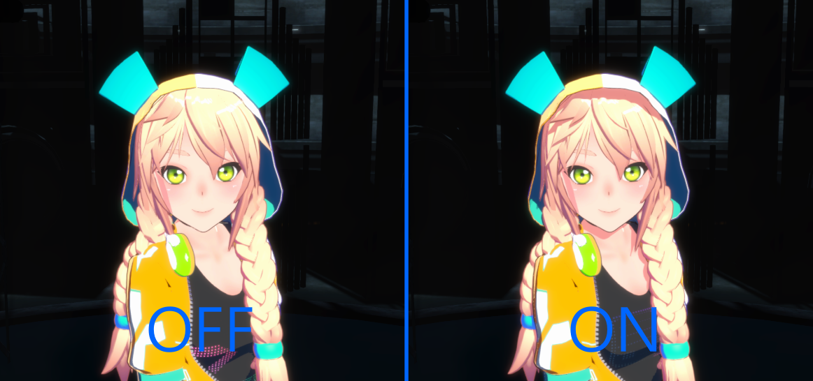
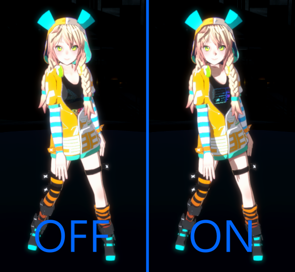
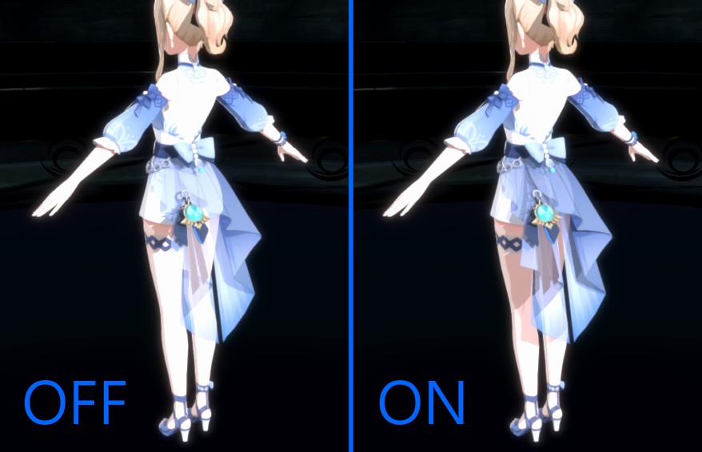

# Toon Character Shadow

This package contains detailed character shadow feature for toon shading in PC/Console platforms, Unity URP projects.

## Character ShadowMap

Character Shadowmap is designed to improve character lighting quality by adding shadow for a single character. There's a room for improvement to cover more than one character, however, currently unsupported without customizing script.

## Additional ShadowMap
It also supports additional local shadow if `useBrightestLight` enabled.
Automatically calculates the most effective lights to the character among all spot lights matching the `FollowLayerMask` in the scene each frame. If the intensity of the brightest spot light is stronger than MainLight(Directional Light), use it for `CharacterShadowMap` instead of the MainLight.

## Transparent Shadow
Transparent shadow is supported as well. However, it uses more memory so enable this when you do need this feature.
